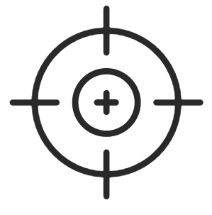
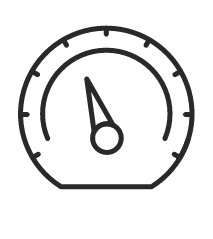
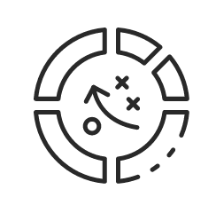
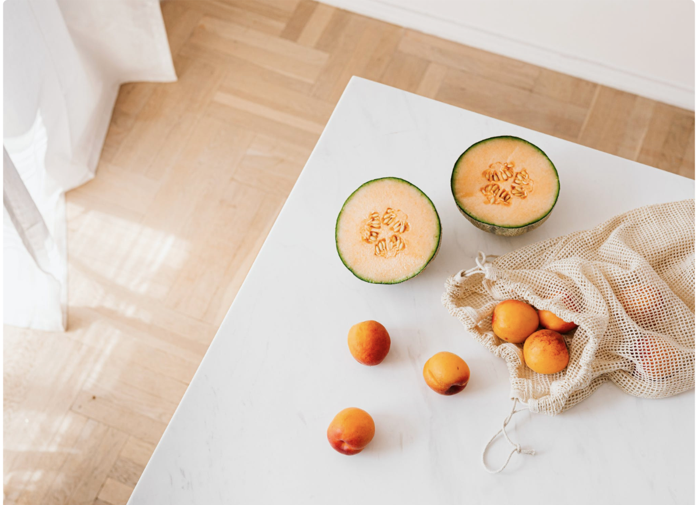

<!doctype html>
<html lang="en">

<head>
  <meta charset="utf-8">
  <meta name="viewport" content="width=device-width, initial-scale=1">
  <title>fyle</title>
  <link rel="icon" href="icon.jpg" type="image/x-icon">
  <link href="https://cdn.jsdelivr.net/npm/bootstrap@5.3.3/dist/css/bootstrap.min.css" rel="stylesheet"
    integrity="sha384-QWTKZyjpPEjISv5WaRU9OFeRpok6YctnYmDr5pNlyT2bRjXh0JMhjY6hW+ALEwIH" crossorigin="anonymous">
  <link rel="stylesheet" href="index.css">

</head>

<body>

  

    

      

        <h6 class="h6">AWARDING WINNING!</h6>
        <h1 class="h1">DIGITAL MARKETING
           AGENCY
        </h1>
        
Morbi sed nec risus finibus feugiat et fermentum nibh.pellentesque vitae ante elit fringilla ac at
          purus ,Marbi sed nec risus finibus feugiat et fermentum

        <a href="./con1.html" target="_blank"> <button class="button">CONTACT US</button></a>
      

      

        
      

    

  

  

    

      

        <h6 class="h6">WHAT WE DO</h6>
        <h1 class="h2">SERVICES PROVIDE
           FOR YOU
        </h1>
      

      

        

          
Morbi sed nec risus finibus feugiat et fermentum nibh.pellentesque vitae ante elit fringilla ac
            at purus ,Marbi sed nec risus finibus feugiat et fermentum

        

      

    

    

      

        

        

        

        

          
          <h6>WEB DEVELOPMENT</h6>
          
Morbised nec risus finibus feugiat  et fermentum nibh.pellentesque 

          <a href="https://www.fylehq.com/"><button class="read-more-button">Read More &#8594;</button></a>
      

        

      

    

    

      

          
.

      

      

          
.

      

      

          
.

      

  

    

  

  <h6 class="h5">WHY CHOOSE US</h6>
  
PEOPLE SAY'S ABOUT US!

  

  

  

    

      

         
        <h6 class="target">Clarify Version & Target </h6>
        
Lorem ipsum dolor sit amet consetetur sadipcing elitr,sed diam nonumy

      

      

         
        <h6>High Performance</h6>
        
Lorem ipsum dolor sit amet consetetur sadipcing elitr,sed diam nonumy

      

      

         
        <h6>Security</h6>
        
Lorem ipsum dolor sit amet consetetur sadipcing elitr,sed diam nonumy

      

      

         
        <h6>Better Strategy & Quality
        </h6>
        
Lorem ipsum dolor sit amet consetetur sadipcing elitr,sed diam nonumy

      

    

  

  <h6 id="project">OUR PROJECT</h6>
  
WHY WE ARE BEST

  

    

      

        
      

      

        

          
Gudielines kei-Japan's Hot   

          <h6 style="font-size: 12px;">Set to launch on the manufacturer's  new A330neo aircraft in 2017 it's  
            offering lots of</h6>
          

            
Best stratagy & Quality  

            <h6 style="font-size: 12px; color:#fafafa">Set to launch on the manufacturer's  new A330neo aircraft in
              2017 it's   offering lots of</h6>
          

          
Gudielines kei-Japan's Hot   

          <h6 style="font-size: 12px;">Set to launch on the manufacturer's  new A330neo aircraft in 2017 it's  
            offering lots of</h6>
        

      

    

  

  <h6 class="h5">EXPERTS GROWTS</h6>
  
OUR COMPANY GROWTH

  

  

  
  

    

      
  <h2 class="number">199+</h2>
         <h4 class="h4"> Satisfied Costumers</h4>
      

    

    

      
 <h2 class="number">1591+</h2>
        <h4 class="h4">Days Of Operation</h4> 
    

    

    

      
 <h2 class="number">283+</h2>
        <h4 class="h4"> Complete Project</h4>
      

    

    

      
  <h2 class="number">75+</h2>
        <h4 class="h4"> Win Awards </h4>
      

    
  

  
</body>

</html>
